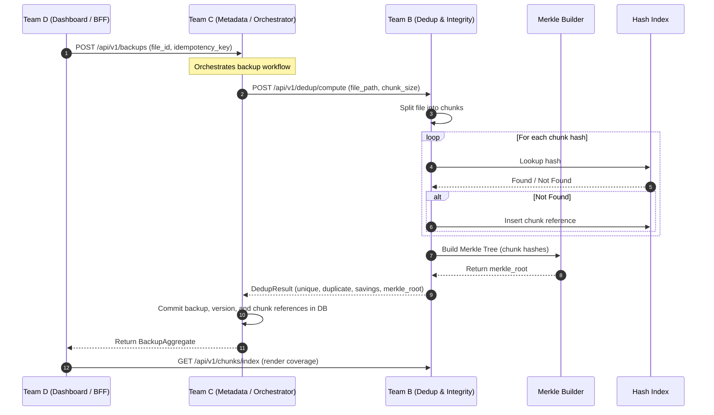

# Team B Architecture & Algorithmic Design Guide

## 1. Architectural Overview

Team B operates as the **Computational Data Structures and Algorithms (DSA) Engine** of the APNILEAP Smart File Backup System. 

```
                                      +---------------------------------------------+
                                      |                 Team D                      |
                                      |   (Backup Control & Restore Dashboard)     |
                                      +----------------------+----------------------+
                                                             |
                                           HTTPS /api/v1     |
                                                             v
                                      +---------------------------------------------+
                                      |                 Team C                      |
                                      | (Metadata, Version & Restore Manager - DBMS)|
                                      +-------+-----------------------------+-------+
                                              |                             |
                       scheduling request     |                             | chunk, dedup, verify
                                              v                             v
                                 +-------------------------+   +------------------------------------+
                                 |         Team A          |   |               Team B               |
                                 |   (Backup Job Scheduler |   |  (Dedup & Integrity Engine - DSA)  |
                                 |     - OS Engine)        |   +------------------------------------+
                                 +-------------------------+
```

### Separation of Concerns
1. **Team C holds transactional authority**: Master catalog of users, files, versions, and chunk references in 3NF relational storage.
2. **Team B holds computational authority**: Pure algorithmic execution. Computes chunk hashes, deduplication diffs, indices, and cryptographic Merkle roots without holding authoritative transactional state.
3. **Team D handles presentation and orchestration**: Interacts with Team B's public telemetry and chunk index endpoints to visualize storage efficiency.

---

## 2. Algorithmic Modules

### 2.1 File Chunking Algorithms

```
                          Original File Stream
                                   |
                +------------------+------------------+
                |                                     |
                v                                     v
       Fixed-Size Chunking                 Content-Defined (CDC)
      - Predictable 4 KB blocks           - Rabin-Karp Rolling Hash
      - Boundary shift vulnerability       - Resilient to shifts/edits
```

1. **Fixed-Size Chunking (`app/chunking/fixed.py`)**:
   - Fixed slice boundaries ($B_i = i \times \text{chunk\_size}$).
   - Fast $O(n)$ linear reading.
   - Best for append-only log files or immutable archives.

2. **Content-Defined Chunking (`app/chunking/rabin_karp.py`)**:
   - Computes rolling polynomial hash over a sliding window ($W = 48$ bytes):
     $$H_{new} = (H_{old} \times \text{BASE} + \text{byte}_{in} - \text{byte}_{out} \times \text{BASE}^W) \pmod M$$
   - Emits a chunk boundary when $H \pmod{\text{avg\_size}} = 0$ (enforced within $[\text{min\_size}, \text{max\_size}]$).
   - Localizes edits so that insertions/deletions only affect the local chunk, avoiding cascade re-chunking.

---

### 2.2 Deduplication Engine (`app/dedup/engine.py`)

```
   Ordered Chunks from File
              |
              v
   +----------------------------------------+
   | For each chunk:                        |
   |   1. Query index for hash              |
   |   2. If found: duplicate_chunks += 1   |
   |   3. Else: unique_chunks += 1          |
   |            insert into index           |
   +----------------------------------------+
              |
              v
   Delta Size = Sum(unique chunk sizes)
   Savings Ratio = (Original Size - Delta Size) / Original Size
   Merkle Root = MerkleTree(ordered chunk hashes)
```

- **Index Consistency Protection**:
  Every deduplication request validates `expected_index_version`. If a stale index version is detected, the engine raises `IndexVersionMismatchError` (HTTP 409) preventing silent inconsistency.

---

### 2.3 Index Implementations & Complexity Comparison

Team B provides three index data structures to support runtime performance comparisons:

| Data Structure | Implementation | Search Complexity | Insert Complexity | Delete Complexity | Memory Overhead |
| :--- | :--- | :---: | :---: | :---: | :---: |
| **HashMap** | `HashMapIndex` (`dict`) | $O(1)$ average | $O(1)$ average | $O(1)$ | Low (~120 KiB / 1k keys) |
| **AVL Tree** | `AVLTree` (Strict balance) | $O(\log n)$ | $O(\log n)$ (Rotations) | $O(\log n)$ | Medium (~210 KiB / 1k keys) |
| **Red-Black Tree** | `RBTree` (Color invariants) | $O(\log n)$ | $O(\log n)$ (Recoloring) | $O(\log n)$ | Medium (~218 KiB / 1k keys) |

#### AVL vs. Red-Black Tree Trade-offs:
- **AVL Trees**: Strictly height-balanced (difference between subtrees $\le 1$). Faster lookups for read-heavy workloads.
- **Red-Black Trees**: Looser balance guarantees (longest path at most $2\times$ shortest). Fewer tree rotations on frequent insertions.

---

### 2.4 Merkle Tree Integrity Verification (`app/merkle/tree.py`)

```
                                  [ Merkle Root ]
                                         ^
                        +----------------+----------------+
                        |                                 |
                  Parent Hash 12                    Parent Hash 34
                   = SHA256(H1+H2)                   = SHA256(H3+H4)
                        ^                                 ^
             +----------+----------+           +----------+----------+
             |                     |           |                     |
           Hash 1                Hash 2      Hash 3                Hash 4
          (Chunk 1)             (Chunk 2)   (Chunk 3)             (Chunk 4)
```

1. **Deterministic Ordering**: Leaves are ordered according to chunk position. If an odd number of chunks exist at any level, the final hash is duplicated to preserve binary symmetry.
2. **Corrupted Chunk Localization**:
   When verification fails against an expected chunk list, `localize_corrupted_chunks` performs element-wise comparisons to isolate the exact corrupted chunk indices (`corrupted_chunks` vs `verified_chunks`).

---

## 3. End-to-End Sequence Flow



---

## 4. Error Handling & Resilience

- **HTTP 400 Bad Request**: Input validation failure (e.g. non-existent file, invalid metric).
- **HTTP 401 Unauthorized**: Missing or incorrect Bearer token when `TEAM_B_API_TOKEN` is configured.
- **HTTP 409 Conflict**: Index version mismatch during deduplication.
- **HTTP 422 Unprocessable Entity**: Schema validation failure (handled by Pydantic exception interceptor).
- **HTTP 429 Too Many Requests**: In-memory rate limit exceeded (1000 requests per second window).
